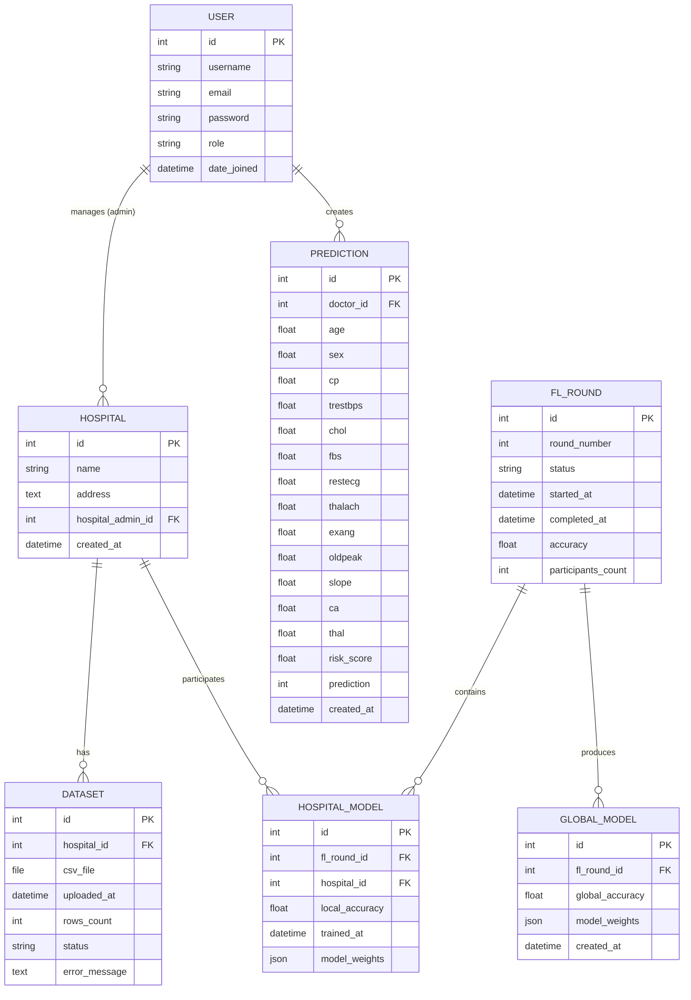

# HeartFL v1.0

[](https://www.python.org/)
[](https://www.djangoproject.com/)
[](LICENSE)
[](https://scikit-learn.org/)

## 🏥 Overview

**HeartFL** is a comprehensive Django-based web application for **heart disease risk prediction** using **Federated Learning (FL)** principles. The platform enables multiple hospitals to collaboratively train machine learning models while maintaining data privacy and security. Doctors can make patient-level predictions using the globally trained model without exposing sensitive patient data.

### 🎯 Key Features

- **🔐 Privacy-Preserving**: Data never leaves hospital premises - only model weights are shared
- **🤝 Collaborative Learning**: Multiple hospitals train together for better model accuracy
- **👥 Multi-Role System**: Support for Super Admin, Hospital Admin, and Doctor roles
- **📊 Real-Time Dashboard**: Monitor federated learning rounds and prediction statistics
- **🔮 Risk Prediction**: Classify heart disease risk as Low, Medium, or High
- **📈 Model Performance Tracking**: Track accuracy across training rounds
- **🏥 Hospital Management**: Manage multiple hospitals and their datasets
- **📁 Dataset Upload**: Support for CSV dataset uploads with validation

---

## 📋 Table of Contents

- [System Architecture](#-system-architecture)
- [Database Schema](#-database-schema)
- [Use Cases](#-use-cases)
- [Activity Diagrams](#-activity-diagrams)
- [Federated Learning Flow](#-federated-learning-flow)
- [Features](#-features)
- [Technology Stack](#-technology-stack)
- [Installation](#-installation)
- [Usage Guide](#-usage-guide)
- [User Roles](#-user-roles)
- [Output Screenshots](#-output-screenshots)
- [API Endpoints](#-api-endpoints)
- [Contributing](#-contributing)
- [License](#-license)

---

## 🏗️ System Architecture

The HeartFL system follows a layered architecture pattern with clear separation of concerns:


### Architecture Components

- **Frontend Layer**: Django templates with Bootstrap for responsive UI
- **Application Layer**: Five core modules handling different business domains
- **Business Logic**: Federated learning algorithms and data processing
- **Data Layer**: SQLite database and file storage for datasets
- **ML Framework**: Scikit-learn for model training and predictions

---

## 🗄️ Database Schema



---

## 👥 Use Cases


---

## 🔄 Activity Diagrams

### 1. Federated Learning Round Process


### 2. Patient Risk Prediction Process


### 3. Hospital Dataset Upload Process


---

## 🔁 Federated Learning Flow


### Federated Learning Algorithm

The system implements **Federated Averaging (FedAvg)** algorithm:

1. **Local Training**: Each hospital trains a Logistic Regression model on its local dataset
2. **Weight Extraction**: Model coefficients and intercepts are extracted
3. **Secure Aggregation**: Weights are aggregated on the central server using weighted averaging
4. **Global Model**: A global model is created from aggregated weights
5. **Distribution**: Global model is used for predictions by all doctors

**Privacy Guarantee**: Raw patient data never leaves hospital premises - only model parameters are shared.

---

## ✨ Features

### For Super Admins
- 👤 Create and manage user accounts
- 🏥 Add and configure hospitals
- 🚀 Initiate federated learning rounds
- 📊 Monitor training progress and accuracies
- 📈 View system-wide statistics

### For Hospital Admins
- 📁 Upload CSV datasets for training
- 📋 View hospital information and dataset details
- 📊 Monitor dataset statistics
- ✅ Verify data upload status

### For Doctors
- 🔮 Create patient risk predictions
- 📝 Input 13 clinical features
- 📊 View risk classifications (Low/Medium/High)
- 📈 Access prediction history
- 💡 Get risk percentage scores

### System Features
- 🔐 Role-based access control (RBAC)
- 🔒 Secure authentication and authorization
- 📊 Interactive dashboard with statistics
- 🎨 Responsive design (mobile-friendly)
- 🔄 Real-time model training status
- 📁 CSV file validation and processing
- 🧮 Automated feature standardization
- 💾 Persistent model storage

---

## 🛠️ Technology Stack

### Backend
- **Framework**: Django 4.2.28
- **Language**: Python 3.8+
- **Database**: SQLite3
- **Authentication**: Django Auth System

### Machine Learning
- **Library**: Scikit-learn 1.3.2
- **Algorithm**: Logistic Regression
- **Data Processing**: Pandas 2.1.4, NumPy 1.26.4

### Frontend
- **Templates**: Django Templates
- **CSS Framework**: Bootstrap 5
- **JavaScript**: Vanilla JS

### Deployment
- **Server**: Django Development Server
- **Static Files**: Django Static Files Handler
- **Media Storage**: Local File System

---

## 📦 Installation

### Prerequisites
- Python 3.8 or higher
- pip (Python package manager)
- Git

### Step 1: Clone the Repository
```bash
git clone https://github.com/yourusername/HeartFL-v1.0.git
cd HeartFL-v1.0
```

### Step 2: Create Virtual Environment (Optional but Recommended)
```bash
python -m venv venv
source venv/bin/activate  # On Windows: venv\Scripts\activate
```

### Step 3: Install Dependencies
```bash
pip install -r requirements.txt
```

### Step 4: Run Database Migrations
```bash
python manage.py migrate
```

### Step 5: Create Sample Data (Optional)
```bash
python manage.py create_sample_data
```

This creates:
- Super Admin: `admin` / `admin123`
- Hospital Admins: `admin_city`, `admin_memorial`, `admin_uni` / `City@123`, `Memorial@123`, `Uni@123`
- Doctor: `doctor1` / `Doctor@123`
- 3 Hospitals with sample datasets

### Step 6: Run the Development Server
```bash
python manage.py runserver
```

Visit **http://localhost:8000** in your browser.

---

## 📖 Usage Guide

### 1. Super Admin Workflow

**Login**: Use credentials `admin` / `admin123`

**Create Hospital**:
1. Navigate to Hospitals → Create New
2. Enter hospital name and address
3. Assign a hospital admin user
4. Save

**Start FL Round**:
1. Ensure hospitals have uploaded datasets
2. Navigate to Federation → Start New Round
3. System automatically:
   - Trains local models on each hospital's data
   - Aggregates model weights
   - Creates global model
4. View results in Round Details

### 2. Hospital Admin Workflow

**Login**: Use credentials like `admin_city` / `City@123`

**Upload Dataset**:
1. Navigate to Hospitals → Upload Dataset
2. Select CSV file with required columns:
   - age, sex, cp, trestbps, chol, fbs, restecg
   - thalach, exang, oldpeak, slope, ca, thal, target
3. System validates and processes the file
4. View dataset details and row count

### 3. Doctor Workflow

**Login**: Use credentials `doctor1` / `Doctor@123`

**Make Prediction**:
1. Navigate to Predictions → New Prediction
2. Enter patient data:
   - **Age**: Age in years
   - **Sex**: 0 = Female, 1 = Male
   - **CP**: Chest pain type (0-3)
   - **Trestbps**: Resting blood pressure
   - **Chol**: Serum cholesterol
   - **Fbs**: Fasting blood sugar > 120 mg/dl (0/1)
   - **Restecg**: Resting ECG results (0-2)
   - **Thalach**: Max heart rate achieved
   - **Exang**: Exercise induced angina (0/1)
   - **Oldpeak**: ST depression
   - **Slope**: Slope of peak exercise ST segment (0-2)
   - **Ca**: Number of major vessels (0-3)
   - **Thal**: Thalassemia (1-3)
3. Submit form
4. View risk score, classification, and recommendations

---

## 👤 User Roles

| Role | Permissions |
|------|-------------|
| **Super Admin** | Full system access, create hospitals, manage users, start FL rounds |
| **Hospital Admin** | Upload datasets, view hospital details, manage hospital data |
| **Doctor** | Create predictions, view prediction history, access dashboard |

---

## 📸 Output Screenshots

### 1. Login Page
The authentication page where users log in with their credentials based on their role.
- Clean, professional interface
- Role-based redirection after login
- Password reset functionality

### 2. Dashboard (Super Admin View)
Comprehensive overview showing:
- Total hospitals, datasets, FL rounds, and predictions
- System-wide statistics
- Quick access to all modules
- Recent activity feed

### 3. Hospital Management
**Hospital List Page**:
- Display all registered hospitals
- Hospital name, address, and admin
- Dataset count per hospital
- Quick actions (View, Edit)

**Hospital Details Page**:
- Hospital information
- List of uploaded datasets
- Dataset statistics
- Upload new dataset button

### 4. Dataset Upload
**Upload Form**:
- File selection interface
- CSV format requirements
- Real-time validation
- Progress indicator

**Upload Success**:
- Confirmation message
- Dataset row count
- Status indicator
- View dataset option

### 5. Federation Learning Rounds
**Round List Page**:
- List of all FL rounds
- Round number, status, and accuracy
- Participant count
- Start date and completion date

**Start New Round Page**:
- Initialize new training round
- Select participating hospitals (auto-selected)
- Training configuration
- Start button

**Round Detail Page**:
- Round status and progress
- Local model accuracies per hospital
- Global model accuracy
- Model weights information
- Aggregation details

### 6. Predictions
**New Prediction Form**:
- 13 input fields for patient features
- Field validation and hints
- Clear labels and placeholders
- Submit button

**Prediction Result Page**:
- Risk score with percentage
- Risk classification with color coding:
  - 🔴 **High Risk** (≥70%): Red badge
  - 🟡 **Medium Risk** (40-69%): Orange badge
  - 🟢 **Low Risk** (<40%): Green badge
- Patient feature summary
- Recommendations based on risk level
- Save to history option

**Prediction History**:
- List of all past predictions
- Date and time of prediction
- Risk score and classification
- Quick view and details
- Filter and search options

### 7. Dashboard Statistics
Visual representations including:
- Bar charts for FL round accuracies
- Pie charts for risk distribution
- Line graphs for prediction trends
- Hospital participation metrics

---

## 🔌 API Endpoints

### Authentication
- `GET /accounts/login/` - Login page
- `POST /accounts/login/` - Authenticate user
- `GET /accounts/logout/` - Logout user
- `GET /accounts/register/` - Registration page
- `POST /accounts/register/` - Create new user

### Dashboard
- `GET /dashboard/` - Main dashboard

### Hospitals
- `GET /hospitals/` - List all hospitals
- `GET /hospitals/<id>/` - Hospital details
- `GET /hospitals/upload/` - Upload dataset form
- `POST /hospitals/upload/` - Process dataset upload

### Federation
- `GET /federation/rounds/` - List FL rounds
- `GET /federation/rounds/<id>/` - Round details
- `GET /federation/start/` - Start new round form
- `POST /federation/start/` - Initiate FL round

### Predictions
- `GET /predictions/` - List predictions
- `GET /predictions/<id>/` - Prediction details
- `GET /predictions/new/` - New prediction form
- `POST /predictions/new/` - Create prediction

---

## 🤝 Contributing

Contributions are welcome! Please follow these steps:

1. Fork the repository
2. Create a feature branch (`git checkout -b feature/AmazingFeature`)
3. Commit your changes (`git commit -m 'Add some AmazingFeature'`)
4. Push to the branch (`git push origin feature/AmazingFeature`)
5. Open a Pull Request

### Coding Standards
- Follow PEP 8 for Python code
- Write docstrings for functions and classes
- Add unit tests for new features
- Update documentation as needed

---

## 📄 License

This project is licensed under the MIT License - see the [LICENSE](LICENSE) file for details.

---

## 🙏 Acknowledgments

- Heart Disease UCI Dataset for inspiration
- Django Community for excellent documentation
- Scikit-learn for ML capabilities
- Bootstrap for UI components


---

## 📊 Project Statistics

- **Lines of Code**: ~2,500+
- **Number of Models**: 7 Django models
- **Number of Views**: 15+ views
- **Number of Templates**: 12 templates
- **Test Coverage**: (To be implemented)

---

**Made with ❤️ for advancing healthcare through privacy-preserving AI**
