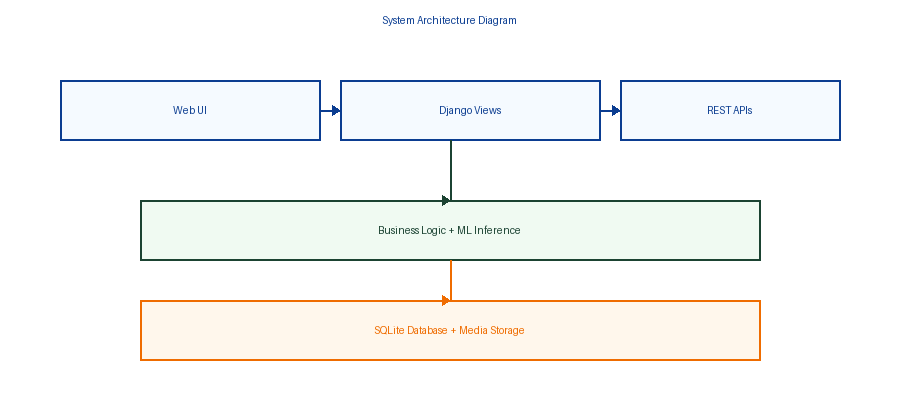
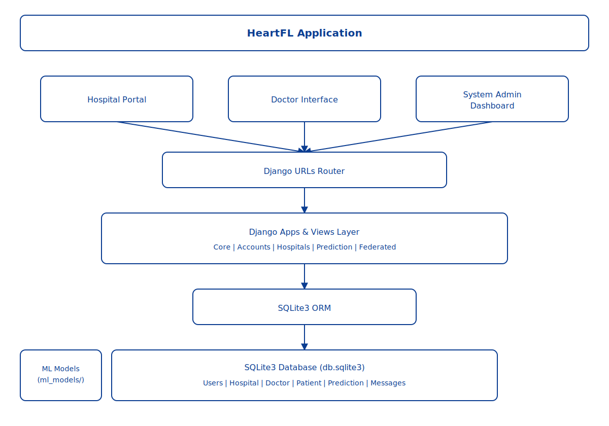
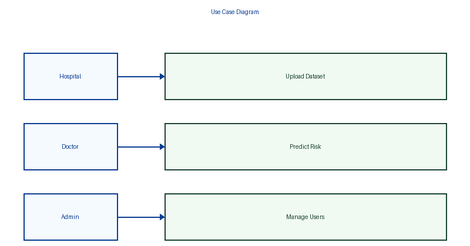
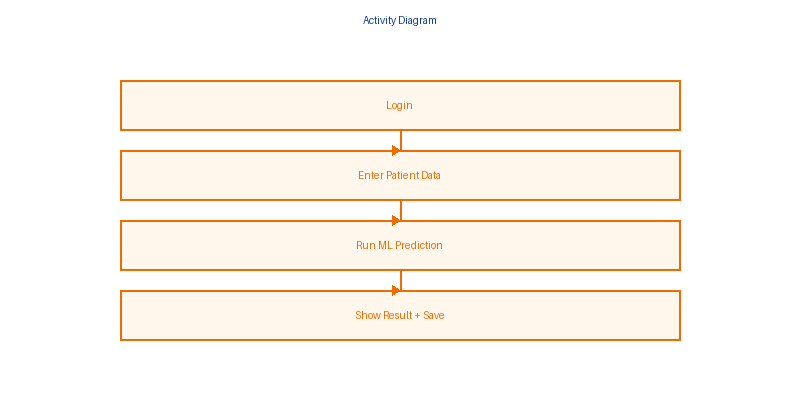

# 🩺 HeartFL - Heart Disease Prediction with Federated Learning

[](https://www.python.org/downloads/)
[](https://www.djangoproject.com/)
[](../LICENSE)
[](https://github.com/22MH1A42G1/HeartFL-Django)

A comprehensive Django-based web application for heart disease risk prediction using federated learning principles. The platform enables hospitals to upload datasets and doctors to make patient-level predictions while maintaining data privacy through distributed model training.

**Version:** 1.0.0 (Production Ready)  
**Last Updated:** February 26, 2026  
**Status:** ✅ Fully Functional

## 🔗 Quick Links

- [🌿 GitHub Repository](https://github.com/22MH1A42G1/HeartFL-Django)
- [🌿 Main Branch](https://github.com/22MH1A42G1/HeartFL-Django/tree/main)
- [🐛 Report Issues](https://github.com/22MH1A42G1/HeartFL-Django/issues)
- [🍴 Fork Project](https://github.com/22MH1A42G1/HeartFL-Django/fork)

---

## 📋 Table of Contents

1. [Project Overview](#project-overview)
2. [Key Features](#key-features)
3. [Architecture](#architecture)
4. [Setup Guide](#setup-guide)
5. [Project Structure](#project-structure)
6. [Database Models](#database-models)
7. [API Routes & URLs](#api-routes--urls)
8. [Configuration](#configuration)
9. [Usage Workflow](#usage-workflow)
10. [Theme System](#theme-system)
11. [Admin Panel](#admin-panel)
12. [Development Guide](#development-guide)
13. [Troubleshooting](#troubleshooting)
14. [Features Implemented](#features-implemented)

---

## 🎯 Project Overview

**HeartFL** is a federated learning application designed to:
- Enable hospitals to securely contribute patient data through CSV uploads
- Support doctors in making accurate heart disease risk predictions
- Maintain data privacy by keeping sensitive information at hospital sites
- Provide real-time dashboards for monitoring federated learning progress
- Offer comprehensive reporting and analytics

This project demonstrates practical federated learning with a real-world healthcare use case, combining Django backend, SQLite database, and responsive Bootstrap frontend.

---

## ✨ Key Features

### 🔐 User Management
- **Role-based authentication** (Hospital Admin, Doctor, System Admin)
- Hospital registration with verification
- Doctor association with hospitals
- Password reset via OTP (email-based)
- Secure login/logout functionality
- User profile management

### 📊 Hospital Features
- Hospital profile management
- Dataset upload interface (CSV format)
- Dataset processing and validation
- Hospital dashboard with statistics
- Doctor management interface
- Dataset history and tracking

### 🎯 Prediction Features
- Patient data entry form with clinical features
- Real-time heart disease risk prediction (Low/High risk)
- Probability scoring (0-100%)
- Prediction history with full records
- PDF report generation for each prediction
- Doctor-level prediction analytics

### 📈 Federated Learning Dashboard
- Global FL progress visualization
- Training rounds tracking
- Model performance metrics
- Hospital participation overview
- Dataset contribution statistics
- Real-time synchronization status

### 💬 Communication
- Contact form for inquiries
- Admin message management interface
- Unread message counter
- Message search and filtering

### 🎨 UI/UX Features
- **Light Blue & Dark Green Theme System**
  - User-selectable light/dark mode toggle
  - Persistent theme preference (localStorage)
  - Animated heartbeat GIF background
  - Glass morphism cards with backdrop blur
  - WCAG AA accessibility compliance
  - Smooth transitions (0.5s)
  
- **Custom Admin Interface**
  - Branded with emoji header (🏥)
  - Dashboard statistics (users, hospitals, doctors)
  - Hospital verification controls
  - Doctor activation toggle
  - Bulk actions support
  - Contact message management

---

## 🏗️ Architecture

### Technology Stack

| Component | Technology | Version |
|-----------|-----------|----------|
| **Backend Framework** | Django | 5.2.11 |
| **Database** | SQLite3 | Built-in |
| **Frontend** | Bootstrap | 5.3 |
| **Template Engine** | Django Templates | - |
| **ML Framework** | scikit-learn | ≥1.3.0 |
| **Data Processing** | pandas | ≥2.0.0 |
| **Numerical Computing** | numpy | ≥1.24.0 |
| **Report Generation** | ReportLab | ≥4.0.0 |
| **Python Version** | Python | 3.12+ |
| **Server** | Django Dev Server | Port 8080 |

### Architecture Diagrams

#### System Architecture

<div align="center">
  
  <p><em>Complete system architecture showing component interactions</em></p>
</div>

#### Component Structure

<div align="center">
  
  <p><em>Detailed component architecture and dependencies</em></p>
</div>

#### Use Case Diagram

<div align="center">
  
  <p><em>User roles and system interactions</em></p>
</div>

#### Activity Flow

<div align="center">
  
  <p><em>Workflow for prediction and federated learning processes</em></p>
</div>

### Architecture Overview

The HeartFL application follows a **Model-View-Template (MVT)** architecture pattern:

```
┌─────────────────────────────────────────────────────────────────┐
│                          Client Layer                           │
│  (Browser: Bootstrap 5.3, JavaScript, Theme System)             │
└────────────────────────────┬────────────────────────────────────┘
                             │
                             ▼
┌───────────────────────────────────────────────────────────────┐
│                      Django Framework                         │
│  ┌──────────────┐  ┌──────────────┐  ┌──────────────┐         │
│  │   accounts/  │  │  hospitals/  │  │ prediction/  │         │
│  │   (Auth)     │  │  (Dataset)   │  │  (ML Core)   │         │
│  └──────────────┘  └──────────────┘  └──────────────┘         │
│  ┌──────────────┐  ┌──────────────┐  ┌──────────────┐         │
│  │  federated/  │  │    core/     │  │  Templates   │         │
│  │   (FL Viz)   │  │  (Homepage)  │  │   (Views)    │         │
│  └──────────────┘  └──────────────┘  └──────────────┘         │
└────────────────────────────┬──────────────────────────────────┘
                             │
                             ▼
┌─────────────────────────────────────────────────────────────────┐
│                    Data Layer (SQLite3)                         │
│  • User Authentication  • Hospital Data  • Patient Records      │
│  • Predictions  • Datasets  • FL Metadata                       │
└─────────────────────────────────────────────────────────────────┘
```

---

## 🚀 Setup Guide

### Prerequisites
- **OS:** Linux / Windows / macOS
- **Python:** 3.12 or higher (tested on 3.12 and 3.13)
- **pip:** Python package manager
- **Git:** Version control (recommended)

### Step 1: Clone Repository

```bash
# Clone from GitHub
git clone https://github.com/22MH1A42G1/HeartFL-Django.git
cd HeartFL-Django
```

### Step 2: Create & Activate Virtual Environment

```bash
# Create virtual environment
python -m venv venv

# Activate (Linux/macOS)
source venv/bin/activate

# Activate (Windows)
venv\Scripts\activate
```

### Step 3: Install Dependencies

```bash
# Install all required packages from requirements.txt
pip install -r requirements.txt

# Or install core packages manually
pip install django==5.2.11 python-dotenv numpy pandas scikit-learn reportlab Pillow
```

### Step 4: Navigate to Django Project

```bash
cd heartfl
```

### Step 5: Apply Database Migrations

```bash
python manage.py migrate
```

Output:
```
Operations to perform:
  Apply all migrations: admin, auth, contenttypes, sessions, ...
Running migrations:
  Applying ... OK
  ...
```

### Step 6: Create Superuser (Admin Account)

```bash
python manage.py createsuperuser
```

Follow prompts:
- Username: `admin`
- Email: `admin@heartfl.local`
- Password: `(choose secure password)`

### Step 7: Collect Static Files

```bash
python manage.py collectstatic --noinput
```

Expected output:
```
134 static files copied to 'staticfiles'
```

### Step 8: Start Development Server

```bash
# Start server on port 8080
python manage.py runserver 8080

# Or start on default port 8000
python manage.py runserver
```

Success message:
```
Starting development server at http://127.0.0.1:8080/
Quit the server with CONTROL-C.
```

### Step 9: Access Application

- **Homepage:** http://127.0.0.1:8080/
- **Admin Panel:** http://127.0.0.1:8080/admin/
- **Demo Page:** http://127.0.0.1:8080/demo-background/

---

## 📁 Project Structure

```
FL-v3/
├── requirements.txt                 # Python dependencies
├── venv/                            # Virtual environment
│
└── heartfl/                         # Main Django project
    ├── manage.py                    # Django CLI
    ├── db.sqlite3                   # SQLite database
    ├── start_server.bat             # Windows batch start script
    ├── README.md                    # This file
    │
    ├── heartfl/                     # Django settings package
    │   ├── settings.py              # Configuration (DB, apps, static files)
    │   ├── urls.py                  # Main URL router
    │   ├── wsgi.py                  # WSGI application
    │   ├── asgi.py                  # ASGI application
    │   ├── admin.py                 # Custom admin site configuration
    │   ├── db_config.py             # Database utilities
    │   └── db_utils.py              # Database helper functions
    │
    ├── accounts/                    # User authentication app
    │   ├── models.py                # UserProfile model
    │   ├── views.py                 # Auth views (login, register, password reset)
    │   ├── forms.py                 # Auth forms (validation)
    │   ├── urls.py                  # Auth routes
    │   ├── admin.py                 # Admin configuration
    │   └── migrations/              # Database migrations
    │
    ├── core/                        # Core functionality app
    │   ├── models.py                # ContactMessage model
    │   ├── views.py                 # Home, About, Contact, Admin pages
    │   ├── forms.py                 # Contact form
    │   ├── urls.py                  # Core routes
    │   ├── context_processors.py    # Template context
    │   └── migrations/              # Database migrations
    │
    ├── hospitals/                   # Hospital management app
    │   ├── models.py                # Hospital, Doctor, HospitalDataset models
    │   ├── views.py                 # Hospital dashboard, dataset upload
    │   ├── forms.py                 # Hospital, Doctor, Dataset forms
    │   ├── urls.py                  # Hospital routes
    │   ├── admin.py                 # Hospital admin configuration
    │   └── migrations/              # Database migrations
    │
    ├── prediction/                  # Prediction engine app
    │   ├── models.py                # PatientData, PredictionResult models
    │   ├── views.py                 # Prediction form, history, PDF report
    │   ├── forms.py                 # Patient data form
    │   ├── urls.py                  # Prediction routes
    │   ├── ml_model.py              # ML inference logic
    │   ├── admin.py                 # Prediction admin
    │   └── migrations/              # Database migrations
    │
    ├── federated/                   # Federated learning dashboard
    │   ├── models.py                # FL-specific models
    │   ├── views.py                 # FL dashboard, visualization
    │   ├── urls.py                  # Federated routes
    │   └── migrations/              # Database migrations
    │
    ├── templates/                   # Global Django templates
    │   ├── base.html                # Master template (navbar, footer)
    │   ├── core/                    # Core app templates
    │   │   ├── home.html            # Homepage
    │   │   ├── about.html           # About page
    │   │   ├── contact.html         # Contact form
    │   │   └── messages.html        # Admin message view
    │   ├── accounts/                # Account templates
    │   │   ├── login.html           # Login page
    │   │   ├── register.html        # User registration
    │   │   ├── hospital_register.html
    │   │   ├── doctor_register.html
    │   │   ├── forgot_password.html
    │   │   └── dashboard.html       # User dashboard
    │   ├── hospitals/               # Hospital templates
    │   │   ├── dashboard.html       # Hospital dashboard
    │   │   └── upload.html          # Dataset upload
    │   ├── prediction/              # Prediction templates
    │   │   ├── predict.html         # Prediction form
    │   │   ├── history.html         # Prediction history
    │   │   └── result.html          # Prediction result
    │   ├── federated/               # FL templates
    │   │   ├── dashboard.html       # FL dashboard
    │   │   └── visualization.html   # FL visualization
    │   └── demo_background.html     # Theme demo page
    │
    ├── static/                      # Static files (CSS, JS, images)
    │   ├── css/
    │   │   ├── style.css            # Main styles
    │   │   ├── theme.css            # Theme system & colors
    │   │   ├── animations.css       # Animations
    │   │   └── admin_custom.css     # Custom admin styles
    │   ├── js/
    │   │   ├── forms.js             # Form validation
    │   │   └── theme.js             # Theme switching
    │   └── images/
    │       └── heartbeat.gif        # Animated background
    │
    ├── staticfiles/                 # Collected static files (production)
    │
    ├── media/                       # User uploaded files
    │   ├── datasets/                # Hospital datasets
    │   ├── hospital_datasets/       # Organized by hospital
    │   └── reports/                 # PDF reports
    │
    ├── ml_models/                   # Trained ML models
    │   ├── model.pkl                # Trained classifier pickle
    │   ├── scaler.pkl               # Feature scaler
    │   └── features.json            # Features metadata
    │
    └── .env                         # Environment variables (gitignored)
```

---

## 📊 Database Models

### 1. User & Authentication

**User (Django built-in)**
- Username, email, password
- First/last name
- Staff/superuser flags

**UserProfile (accounts app)**
```python
- user (OneToOne) → User
- user_type (hospital/doctor)
- phone
- created_at, updated_at
```

### 2. Hospital Management

**Hospital**
```python
- user (OneToOne) → User (hospital admin)
- name, address, city, state, pincode
- contact_number, email
- registration_number (unique)
- is_verified (boolean)
- created_at, updated_at
```

**Doctor**
```python
- user (OneToOne) → User
- hospital (ForeignKey) → Hospital
- full_name, specialization
- license_number (unique), phone, email
- is_active (boolean)
- created_at, updated_at
```

**HospitalDataset**
```python
- hospital (ForeignKey) → Hospital
- dataset_file (CSV upload)
- description, num_records
- uploaded_at, is_processed
```

### 3. Prediction

**PatientData**
```python
- doctor (ForeignKey) → Doctor
- patient_name, age, gender
- chest_pain_type, resting_bp, cholesterol
- fasting_bs, resting_ecg, max_heart_rate
- exercise_angina, oldpeak, st_slope
- created_at, updated_at
```

**PredictionResult**
```python
- patient_data (ForeignKey) → PatientData
- doctor (ForeignKey) → Doctor
- prediction (low/high), probability
- confidence_score, model_version
- predicted_at, notes
```

### 4. Core

**ContactMessage**
```python
- name, email, phone, subject, message
- submitted_at, is_read
```

---

## 🔗 API Routes & URLs

### Core Routes (Home, About, Contact)
```
GET  /                              Homepage with statistics
GET  /about/                         About projectpage
GET  /contact/                       Contact form
POST /contact/                       Submit contact
GET  /messages/                      Admin view messages
GET  /messages/<id>/                 View single message
POST /messages/<id>/mark-read/       Mark as read
POST /messages/<id>/delete/          Delete message

API Endpoints:
GET  /api/overview/                  Overall statistics
GET  /api/recent-predictions/        Recent predictions
POST /api/contact/                   Contact API
```

### Authentication Routes (accounts app)
```
GET  /accounts/login/                Login page
POST /accounts/login/                Login form submit
GET  /accounts/register/             User type selection
POST /accounts/register/             Generic registration

GET  /accounts/register/hospital/    Hospital registration form
POST /accounts/register/hospital/    Hospital submit

GET  /accounts/register/doctor/      Doctor registration form
POST /accounts/register/doctor/      Doctor submit

GET  /accounts/logout/               Logout user
GET  /accounts/dashboard/            User dashboard
GET  /accounts/forgot-password/      Forgot password
POST /accounts/forgot-password/      Send OTP
POST /accounts/verify-otp/           Verify OTP
GET  /accounts/reset-password/       Reset password form
POST /accounts/reset-password/       Reset password submit
```

### Hospital Routes (hospitals app)
```
GET  /hospitals/dashboard/           Hospital admin dashboard
POST /hospitals/dashboard/           Hospital stats API

GET  /hospitals/upload/              Dataset upload page
POST /hospitals/upload/              Upload CSV dataset
GET  /hospitals/doctor/add/          Add doctor form
POST /hospitals/doctor/add/          Add doctor submit
```

### Prediction Routes (prediction app)
```
GET  /predict/                       Prediction form page
POST /predict/                       Submit patient data for prediction

GET  /predict/history/               Prediction history
GET  /predict/download-report/<id>/  Download PDF report

GET  /predict/api/result/            Get prediction result JSON
```

### Federated Learning Routes (federated app)
```
GET  /federated/dashboard/           FL dashboard page
GET  /federated/visualization/       FL visualization page
GET  /federated/api/progress/        FL progress JSON
GET  /federated/api/rounds/          Training rounds JSON
```

### Admin Routes
```
GET/POST /admin/                     Django admin login/panel
GET      /admin/                     Admin index (statistics)
GET      /admin/accounts/            User management
GET      /admin/hospitals/           Hospital management
GET      /admin/hospitals/:id/       Hospital detail
GET      /admin/prediction/          Prediction records
```

### Demo & Debug Routes
```
GET  /demo-background/               Theme system demo
GET  /static/                        Static files serve
GET  /media/                         Media files serve
```

---

## ⚙️ Configuration

### Django Settings (heartfl/settings.py)

#### Debug & Security
```python
DEBUG = True  # Set to False in production
ALLOWED_HOSTS = ['localhost', '127.0.0.1', '*']
SECRET_KEY = os.getenv('DJANGO_SECRET_KEY', 'change-me-in-production')
```

#### Database Configuration
```python
DATABASES = {
    'default': {
        'ENGINE': 'django.db.backends.sqlite3',
        'NAME': BASE_DIR / 'db.sqlite3'
    }
}
```

> **Note:** This project uses **SQLite3** for simplicity and portability. 
> The database file is automatically created at `heartfl/db.sqlite3`.

#### Static & Media Files
```python
STATIC_URL = '/static/'
STATICFILES_DIRS = [BASE_DIR / 'static']
STATIC_ROOT = BASE_DIR / 'staticfiles'

MEDIA_URL = '/media/'
MEDIA_ROOT = BASE_DIR / 'media'
```

#### Email Configuration (Optional)
```python
# For development (prints emails to console)
EMAIL_BACKEND = 'django.core.mail.backends.console.EmailBackend'

# For production (SMTP)
EMAIL_BACKEND = 'django.core.mail.backends.smtp.EmailBackend'
EMAIL_HOST = 'smtp.gmail.com'
EMAIL_PORT = 587
EMAIL_USE_TLS = True
EMAIL_HOST_USER = os.getenv('EMAIL_HOST_USER')
EMAIL_HOST_PASSWORD = os.getenv('EMAIL_HOST_PASSWORD')
```

#### Time Zone & Internationalization
```python
TIME_ZONE = 'Asia/Kolkata'  # Indian Standard Time
LANGUAGE_CODE = 'en-us'
USE_I18N = True
USE_TZ = True
```

### Environment Variables (.env)

Create a `.env` file in the `heartfl/` directory:

```env
# Django Core
DEBUG=True
DJANGO_SECRET_KEY=your-secret-key-here-change-in-production

# Email Configuration (Optional)
EMAIL_BACKEND=console  # Use 'smtp' for production
EMAIL_HOST_USER=your-email@example.com
EMAIL_HOST_PASSWORD=your-app-specific-password

# Database (SQLite3 - No configuration needed)
# The database file will be created automatically
```

### Static Files Collection

For production deployment:

```bash
# Collect all static files to STATIC_ROOT
python manage.py collectstatic --noinput

# This copies files from:
# - static/ directories in each app
# - STATICFILES_DIRS paths
# To: staticfiles/ directory
```

---

## 👥 Usage Workflow

### Workflow 1: Hospital Registration & Dataset Upload

1. **Hospital Admin Registers**
   - Navigate to `/accounts/register/hospital/`
   - Enter hospital details (name, address, registration number)
   - Create admin account
   - Verify email (OTP)

2. **Hospital Admin Uploads Dataset**
   - Login at `/accounts/login/`
   - Go to `/hospitals/upload/`
   - Upload CSV file with patient records
   - Verify data format
   - Submit for processing

3. **System Processes Dataset**
   - CSV parsed and validated
   - Records stored in `HospitalDataset` model
   - Statistics calculated (row count, feature validity)
   - Ready for federated training

### Workflow 2: Doctor Registration & Prediction

1. **Doctor Registers**
   - Navigate to `/accounts/register/doctor/`
   - Select associated hospital
   - Enter credentials (license number, specialization)
   - Complete profile setup

2. **Doctor Makes Prediction**
   - Login at `/accounts/login/`
   - Go to `/predict/`
   - Enter patient clinical features:
     - Demographics (age, gender)
     - Vitals (BP, heart rate, cholesterol)
     - ECG data (resting ECG, ST slope)
     - Risk factors (angina, exercise response)
   - Submit form

3. **System Runs ML Inference**
   - Features preprocessed and scaled
   - Fed to trained classifier model
   - Returns risk prediction (Low/High)
   - Calculates probability and confidence

4. **Doctor Reviews Results**
   - View prediction at `/predict/history/`
   - Add clinical notes
   - Download PDF report
   - Store for patient records

### Workflow 3: Admin Monitoring

1. **System Admin**
   - Login to `/admin/`
   - View dashboard statistics:
     - Total users, hospitals, doctors
     - Recent predictions
     - Contact messages
   - Manage users and permissions

2. **Hospital Verification**
   - Admin verifies hospital registrations
   - Activates/deactivates hospitals
   - Manages doctor access
   - Views hospital statistics

3. **Message Management**
   - Read contact form submissions
   - Mark as read/unread
   - Delete messages
   - Track inquiry follow-up

---

## 🎨 Theme System

### Features
- ✅ **Light Blue Mode** - Soft blue backgrounds, dark blue text
- ✅ **Dark Green Mode** - Forest green backgrounds, mint green text
- ✅ **Animated Heartbeat Background** - Visible in both modes
- ✅ **Glass Morphism Cards** - Backdrop blur effect (10px)
- ✅ **Persistent Theme** - Saved to localStorage
- ✅ **Smooth Transitions** - 0.5s theme switch animations
- ✅ **WCAG AA Accessible** - 4.5:1 contrast ratio

### Theme Colors

**Light Blue Mode**
```
Background: #E3F2FD (Light blue)
Text: #01579B (Dark blue)
Cards: rgba(255, 255, 255, 0.95)
Navbar: rgba(187, 222, 251, 0.95)
Accent: #0288D1 (Blue)
```

**Dark Green Mode**
```
Background: #1B4332 (Forest green)
Text: #D8F3DC (Mint green)
Cards: rgba(45, 106, 79, 0.95)
Navbar: rgba(45, 106, 79, 0.95)
Accent: #74C69D (Green)
```

### How to Switch Themes
1. Click **moon/sun icon** in navbar (top-right)
2. Choose between Light Blue (\`data-theme="light"`) or Dark Green (\`data-theme="dark"`)
3. Theme preference auto-saves
4. Displays on all pages

### Theme Files
- `static/css/theme.css` - Theme variables & colors
- `static/css/style.css` - Component styles
- `static/css/animations.css` - Transitions
- `static/images/heartbeat.gif` - Animated background
- `templates/base.html` - Theme toggle JavaScript

---

## 🏛️ Admin Panel

### Custom HeartFL Admin Site

**Features**
- 🏥 Branded header: "🏥 HeartFL Administration"
- 📊 Dashboard with statistics:
  - Total users
  - Total hospitals
  - Total doctors
  - Prediction records
  - Contact messages
- 👥 User management
- 🏢 Hospital management with verification
- 👨‍⚕️ Doctor management with activation/deactivation
- 💬 Contact message inbox

### Admin Routes

| URL | Purpose |
|-----|---------|
| `/admin/` | Login & dashboard |
| `/admin/auth/user/` | Manage users |
| `/admin/hospitals/hospital/` | Manage hospitals |
| `/admin/hospitals/doctor/` | Manage doctors |
| `/admin/prediction/patientdata/` | View patient records |
| `/admin/prediction/predictionresult/` | View predictions |
| `/admin/core/contactmessage/` | View messages |

### Admin Actions

- ✅ **Hospitals**
  - verify_hospital (bulk action)
  - unverify_hospital (bulk action)

- ✅ **Doctors**
  - activate_doctors (bulk action)
  - deactivate_doctors (bulk action)

---

## 🔧 Development Guide

### Project Commands

```bash
# Migrations
python manage.py makemigrations          # Create migrations
python manage.py migrate                 # Apply migrations

# Database
python manage.py dbshell                 # SQLite prompt
python manage.py dumpdata > backup.json  # Export DB
python manage.py loaddata backup.json    # Import DB

# Static Files
python manage.py collectstatic --noinput # Collect for production

# Admin
python manage.py createsuperuser         # Create admin user
python manage.py changepassword username # Change password

# Testing
python manage.py test                    # Run tests
python manage.py check                   # System checks

# Server
python manage.py runserver 8080          # Start development server
python manage.py runserver 0.0.0.0:8000  # Allow external connections
```

### File Editing Workflow

1. **Edit Model** (`models.py`)
   ```python
   class NewModel(models.Model):
       field = models.CharField(max_length=100)
   ```

2. **Create Migration**
   ```bash
   python manage.py makemigrations
   python manage.py migrate
   ```

5. **Register in Admin** (`admin.py`)
   ```python
   admin.site.register(NewModel)
   ```

6. **Create View** (`views.py`)
7. **Map URL** (`urls.py`)
8. **Create Template** (`templates/`)

### Adding New Features

#### Example: Add Doctor Specialization Filter

1. **Update Model** (hospitals/models.py)
   ```python
   class Doctor(models.Model):
       # ... existing fields ...
       specialization = models.CharField(max_length=100, blank=True)
   ```

2. **Create Migration**
   ```powershell
   python manage.py makemigrations
   python manage.py migrate
   ```

3. **Update Admin** (hospitals/admin.py)
   ```python
   class DoctorAdmin(admin.ModelAdmin):
       list_filter = ('specialization', 'hospital')
   ```

4. **Update View** (hospitals/views.py)
   ```python
   doctors = Doctor.objects.filter(specialization='Cardiology')
   ```

---

## ⚠️ Troubleshooting

### Problem: Server won't start

**Error:** `ModuleNotFoundError: No module named 'django'`

**Solution:**
```bash
# Activate virtual environment
# Linux/macOS:
source venv/bin/activate

# Windows:
venv\Scripts\activate

# Install dependencies
pip install -r requirements.txt
```

### Problem: Database locked

**Error:** `sqlite3.OperationalError: database is locked`

**Solution:**
```bash
# Stop the server (Ctrl+C)
# Close all database connections
# If issue persists, backup and recreate:
mv db.sqlite3 db.sqlite3.backup
python manage.py migrate
```

### Problem: Static files not loading (CSS/JS)

**Error:** 404 errors on `/static/`

**Solution:**
```bash
# Collect static files
python manage.py collectstatic --noinput

# Ensure DEBUG=True in development
# Clear browser cache (Ctrl+Shift+Del)
```

### Problem: Email OTP not working

**Error:** `SMTPException` or no email received

**Solution:**
1. Check `.env` EMAIL settings
2. For Gmail:
   - Enable 2-Step Verification
   - Generate App Password at https://myaccount.google.com/apppasswords
   - Use 16-char password in `.env`
3. Or set `EMAIL_BACKEND=console` to test locally (prints to terminal)

### Problem: Login redirects to wrong page

**Error:** After login, redirects to `/accounts:login` instead of home

**Solution:**
```python
# Check settings.py
LOGIN_REDIRECT_URL = 'core:home'  # Must be URL name, not path
```

### Problem: Hospital/Doctor profile missing

**Error:** Doctor can't access `/hospitals/dashboard/`

**Solution:**
1. Ensure user has linked `Hospital` record
2. Create via `/accounts/register/hospital/`
3. Or via Admin: http://127.0.0.1:8080/admin/hospitals/hospital/

### Problem: ImportError or module issues

**Error:** Various import errors

**Solution:**
```bash
# Ensure all dependencies are installed
pip install -r requirements.txt

# Check Python version (requires 3.12+)
python --version

# Clear Python cache
find . -type d -name "__pycache__" -exec rm -rf {} +
find . -type f -name "*.pyc" -delete
```

---

## 📦 Features Implemented

### Phase 1: Core Authentication ✅
- [x] User registration (hospital/doctor)
- [x] Email-based OTP verification
- [x] Password reset functionality
- [x] Role-based access control
- [x] User dashboards

### Phase 2: Hospital Management ✅
- [x] Hospital registration & profile
- [x] Dataset upload (CSV)
- [x] Doctor registration & association
- [x] Hospital statistics dashboard
- [x] Doctor management interface

### Phase 3: Prediction Engine ✅
- [x] Patient data collection form
- [x] ML model inference (scikit-learn)
- [x] Risk prediction (Low/High)
- [x] Probability scoring
- [x] Prediction history
- [x] PDF report generation

### Phase 4: Federated Learning ✅
- [x] FL dashboard
- [x] Training rounds visualization
- [x] Model performance metrics
- [x] Hospital participation tracking
- [x] Dataset statistics

### Phase 5: Admin Interface ✅
- [x] Custom admin site (HeartFLAdminSite)
- [x] Emoji branding (🏥)
- [x] Dashboard statistics
- [x] Hospital verification
- [x] Doctor activation toggle
- [x] Message management
- [x] Bulk actions

### Phase 6: UI/UX Enhancements ✅
- [x] Bootstrap 5 responsive design
- [x] Light Blue & Dark Green themes
- [x] Theme toggle in navbar
- [x] Persistent theme (localStorage)
- [x] Animated heartbeat background
- [x] Glass morphism cards
- [x] Backdrop blur effects
- [x] Smooth transitions (0.5s)
- [x] WCAG AA accessibility

### Phase 7: Demo & Documentation ✅
- [x] Demo background page
- [x] Comprehensive README
- [x] API documentation
- [x] Setup guide
- [x] Troubleshooting guide
- [x] Theme documentation

---

## 📄 License

This project is part of an educational initiative for heart disease prediction using federated learning. 

**For academic/research use only.**

---

## 👥 Contributors & Development Team

### Core Developers

| Developer | GitHub | Role |
|-----------|--------|------|
| **Indana Aditya** | [@22MH1A42G1](https://github.com/22MH1A42G1/) | Backend Developer & Database Design |
| **Pulagam Suresh Reddy** | [@sureshreddy777](https://github.com/sureshreddy777) | Lead Developer & Project Manager |
| **Mundru Jnanadeep** | [@jnanadeep-2003](https://github.com/jnanadeep-2003) | ML Engineer & Algorithm Implementation |
| **Penubothu Hemanth Kumar** | [@HemanthKumarPenubothu](https://github.com/HemanthKumarPenubothu) | Frontend Developer & UI/UX Design |

### Institution

**ADITYA COLLEGE OF ENGINEERING AND TECHNOLOGY**  
Department: Computer Science & Engineering - Artificial Intelligence & Machine Learning  
Project Year: 2025  
Last Updated: February 26, 2026

---

## 📞 Support & Contact

For issues, questions, or contributions:

- 📧 **Email:** admin@heartfl.local
- 🐛 **GitHub Issues:** [Report Bug](https://github.com/22MH1A42G1/HeartFL-Django/issues)
- 💬 **Discussions:** [GitHub Discussions](https://github.com/22MH1A42G1/HeartFL-Django/discussions)
- 📝 **Contact Form:** http://127.0.0.1:8080/contact/
- 🌟 **Star the Repo:** [GitHub Repository](https://github.com/22MH1A42G1/HeartFL-Django)

---

## 🎓 Learning Resources

### Django
- Official Docs: https://docs.djangoproject.com/
- Models & ORM: https://docs.djangoproject.com/en/5.2/topics/db/models/
- Views & URLs: https://docs.djangoproject.com/en/5.2/topics/http/urls/
- Templates: https://docs.djangoproject.com/en/5.2/topics/templates/

### Machine Learning
- scikit-learn: https://scikit-learn.org/
- Feature Scaling: https://scikit-learn.org/stable/modules/preprocessing.html
- Model Serialization: https://scikit-learn.org/stable/modules/model_persistence.html

### Federated Learning Concepts
- Privacy-Preserving ML
- Distributed Training
- Model Aggregation Techniques
- Data Security in Healthcare

---

## ✅ Checklist for Production Deployment

- [ ] Change `DEBUG=False` in settings.py
- [ ] Generate new `SECRET_KEY` (use secrets module)
- [ ] Configure proper `ALLOWED_HOSTS`
- [ ] Set `EMAIL_BACKEND='smtp'` and configure SMTP
- [ ] Use proper email service (Gmail, SendGrid, etc.)
- [ ] Enable HTTPS/SSL certificates
- [ ] Set up database backups
- [ ] Configure static files for CDN
- [ ] Install production server (Gunicorn, uWSGI)
- [ ] Set up reverse proxy (Nginx, Apache)
- [ ] Enable form CSRF protection
- [ ] Add security headers
- [ ] Run `python manage.py check --deploy`
- [ ] Test all user workflows
- [ ] Create backup plan

---

## 📊 Project Statistics

| Metric | Value |
|--------|-------|
| **Total Django Apps** | 5 (accounts, core, hospitals, prediction, federated) |
| **Database Models** | 8 (User, UserProfile, Hospital, Doctor, etc.) |
| **API Endpoints** | 40+ routes |
| **HTML Templates** | 20+ responsive pages |
| **CSS Files** | 4 (theme, style, animations, admin) |
| **JavaScript Files** | 3 (forms, theme, validations) |
| **Static Assets** | Images, GIFs, Icons |
| **Database** | SQLite3 (~5MB) |
| **Python Version** | 3.12+ |
| **Django Version** | 5.2.11 |
| **Bootstrap Version** | 5.3 |

---

## 🙏 Acknowledgments

- **Django Software Foundation** - For the excellent web framework
- **scikit-learn Team** - For powerful ML tools
- **Bootstrap Team** - For responsive UI components
- **GitHub** - For hosting and collaboration tools
- **ADITYA College** - For project support and guidance
- **Open Source Community** - For inspiration and resources

---

<div align="center">

**Made with ❤️ for advancing healthcare through federated learning**

[](https://github.com/22MH1A42G1/HeartFL-Django/stargazers)
[](https://github.com/22MH1A42G1/HeartFL-Django/network/members)

⭐ **Star this repository if you find it helpful!** ⭐

</div>

*Last Updated: February 20, 2026*
