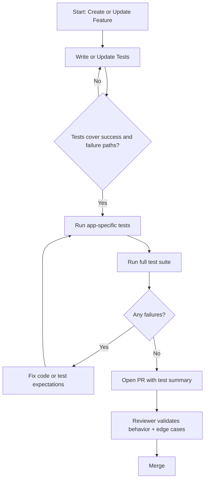
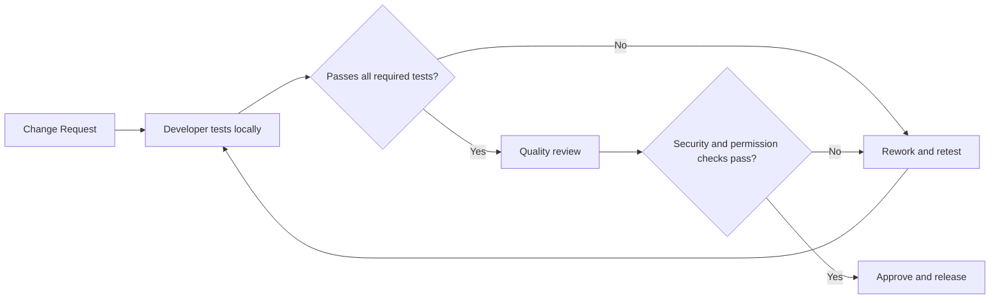

# HeartFL Testing Document

## Purpose
This document defines a practical testing strategy for HeartFL-Django, including what to test, how to run tests, and the expected quality gates before release.

## Scope
Testing covers:
- Django apps: `accounts`, `core`, `hospitals`, `prediction`, `federated`
- Authentication and role-based access control
- Dataset upload/validation paths
- Prediction workflows and report generation
- Federated learning dashboard and related views

Out of scope (for now):
- Browser-level end-to-end automation with Selenium/Playwright
- Performance load testing at scale

## Test Types
- Unit tests: model methods, form validation, utility functions
- Integration tests: view + form + model interaction, URL routing, permissions
- Regression tests: bug-specific tests added for any production issue
- Smoke tests: basic health checks for key routes and login flow

## Test Data Guidelines
- Use small, deterministic fixtures
- Avoid committing sensitive health data
- Prefer synthetic CSV files for dataset upload tests
- Keep each test independent (no order dependency)

## Local Test Execution
From the project directory:

```bash
cd heartfl
python manage.py test
```

Run app-level tests:

```bash
python manage.py test accounts
python manage.py test core
python manage.py test hospitals
python manage.py test prediction
python manage.py test federated
```

Run with higher verbosity:

```bash
python manage.py test -v 2
```

## Testing Workflow (Flowchart)


## Request-to-Release Validation Flow


## Suggested Minimum Coverage Matrix
| Area | Unit | Integration | Regression |
|---|---:|---:|---:|
| Auth and Roles | High | High | Medium |
| Dataset Upload | Medium | High | High |
| Prediction Engine | High | High | High |
| Federated Dashboard | Medium | Medium | Medium |
| Admin Utilities | Medium | Medium | Low |

## Release Quality Gate
A change is release-ready when:
- All affected app tests pass
- No existing tests regress
- New behavior includes at least one test
- Permission-sensitive endpoints are validated
- High-risk changes include regression tests

## Common Test Cases Checklist
- Login required for protected pages
- Hospital user cannot access another hospital's data
- Invalid CSV upload returns clear validation errors
- Prediction form rejects invalid or missing fields
- Prediction output is persisted and visible in history
- PDF report generation handles boundary values
- Federated metrics pages load without server errors

## Maintenance Rules
- Add tests in the same PR as functional changes
- Keep test names behavior-focused and explicit
- Remove flaky tests immediately and replace with stable checks
- Update this document when process or quality gates change
